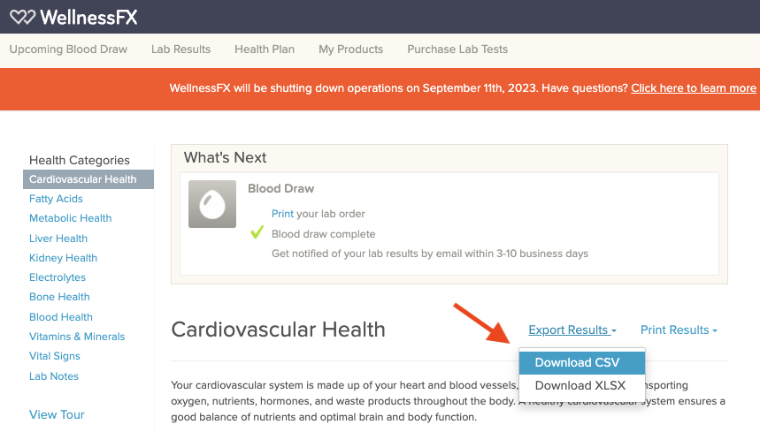

# Biomarker Dashboard
Simple dashboard to visualize trends in bloodwork biomarkers.

## Introduction
This Biomarker Dashboard provides an easy-to-use interface to visualize and understand trends in your bloodwork biomarkers. Originally designed to import and visualize data from WellnessFX, this dashboard is a vital tool for those looking to transition their data elsewhere due to WellnessFX's shutdown. However, it's flexible enough to be used with any dataset following the prescribed format.

## Data Export from WellnessFX
If you've been using WellnessFX and want to migrate your data:

1. Visit [WellnessFX website](https://www.wellnessfx.com/).
2. Once logged in, you'll find an "Export Results" option on the homepage.
3. Click on this option and from the dropdown menu, select "Download CSV".





By following the above steps, you'll obtain a CSV file named `test_result_export.csv` which can be easily imported into this dashboard.

## CSV Input Format
For those who wish to continue adding their own data or for general understanding, it's essential to format the CSV correctly. Here's the expected structure:

| Draw Date | Marker Name | Marker Description | Value | Units | Reference Range | Source | 
|-----------|-------------|--------------------|-------|-------|-----------------|--------|

### Details

- **Draw Date:** The date when the bloodwork was done. Expected format: `MM/DD/YY` (e.g., `01/31/21` for January 31, 2021).
- **Marker Name:** The specific name of the biomarker (e.g., `HDL`, `Free Testosterone`). See the YAML file with a list of supported biomarkers and their categories [here](categories.yaml).
- **Marker Description:** A brief description or details about the biomarker. This field can be kept empty if not available.
- **Value:** The recorded value for the biomarker in the bloodwork. This can be a numerical value (e.g., `5.6`).
- **Units:** The measurement unit for the value (e.g., `mg/dL`, `mmol/L`).
- **Reference Range:** The normal or reference range for the biomarker. It's typically provided in the format `min_value-max_value` (e.g., `4.5-6.0`). This can be helpful to understand if your values are within the expected range. A variety of input formats for reference ranges are supported, see the [parsing test code](tests/test_parse_reference_range.py) for examples of what is supported.
- **Source** (Optional)**:** The source or lab where the bloodwork was done.

## Getting Started

```bash
git clone https://github.com/NoTranslationLayer/biomarkerdash
cd biomarkerdash
pip install .
cd scripts
./load_wellnessfx.py test_result_export.csv
```

If the CSV file was downloaded to a different directory, replace `test_result_export.csv` above with the full path to the CSV file.

The script will generate a file named `BiomarkerDashboard.html` in the top level folder of the cloned repository. Open the file in any web browser to visualize the exported data.


## Contributing
Feel free to contribute to this project by opening issues or submitting pull requests. Any feedback or improvements are welcomed.

## License
This project is licensed under the BSD 3-clause license - see the [LICENSE.md](LICENSE.md) file for details.